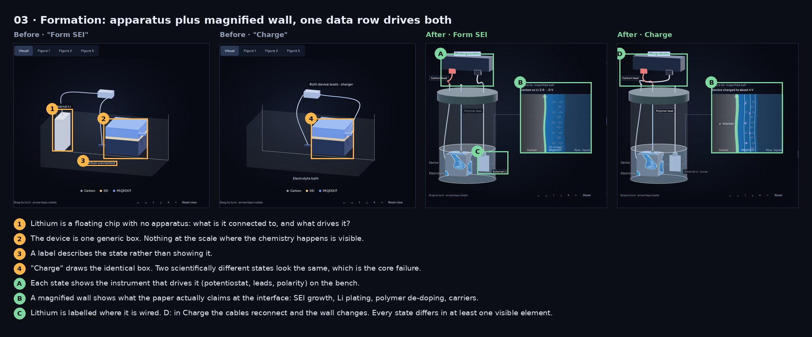
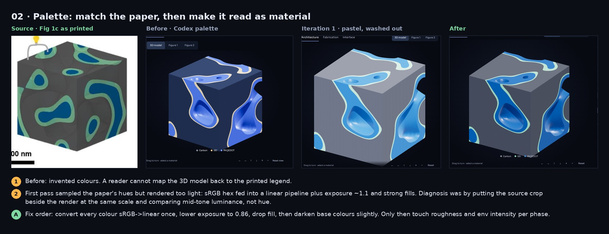
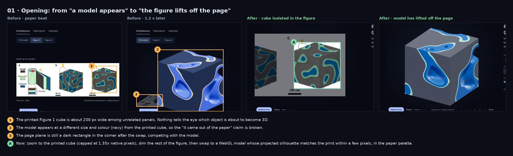
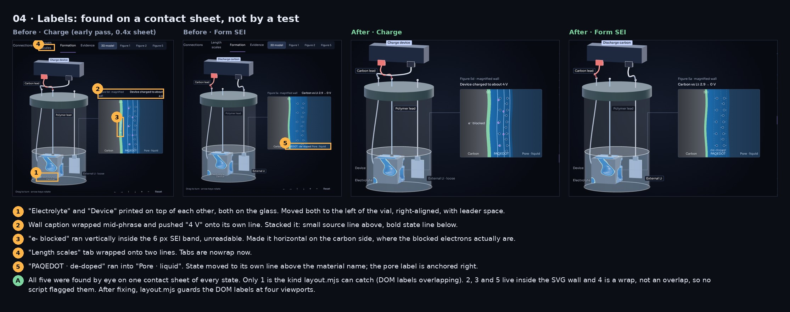
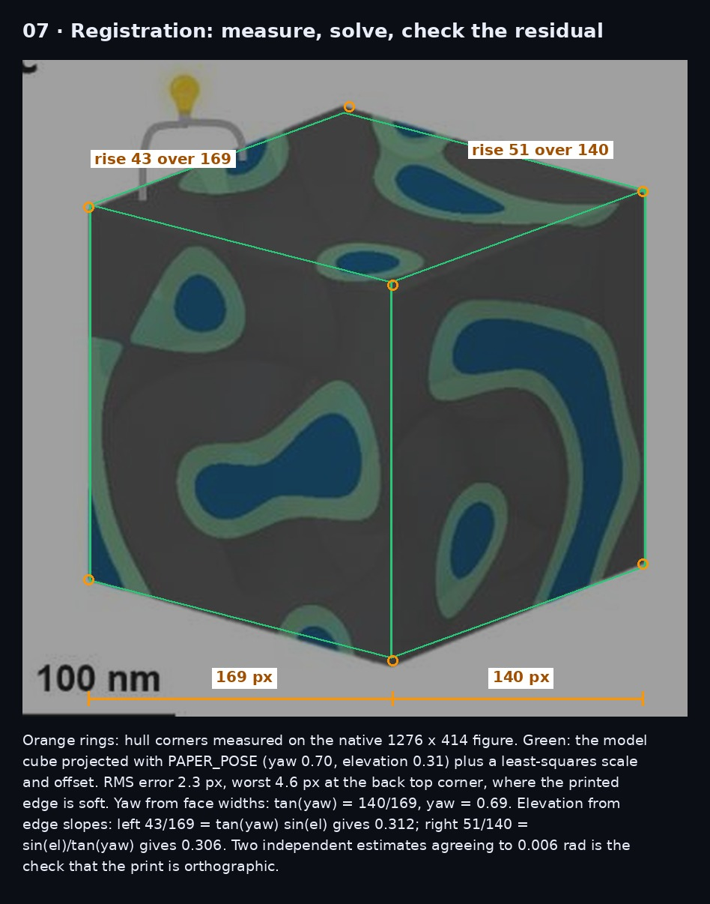
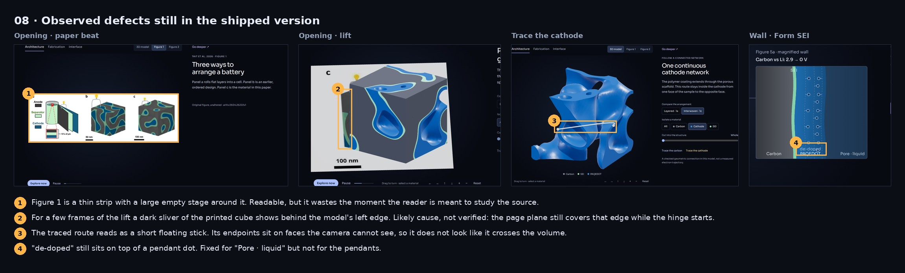

# Working method: how the interwoven battery companion reached its standard

This is a companion to `../how-it-was-made.md`. That file is the playbook. This one answers seven specific questions with evidence, so another agent can apply the same judgment to a different paper.

The images beside this file are annotated boards:
- Amber numbers mark what was wrong.
- Green letters mark what replaced it.

Every "before" image is a real capture: the Codex version (commit `81dfe39`) or one of my intermediate passes. None of them is a mock-up. Where a capture no longer exists at full resolution, the board says so.

Code references are to `main` at `defeef0`.

---

## 1. What made the biggest difference

In order of impact:

1. **Making every state visibly different.** This applies to Formation above all (board 03).
2. **Taking the palette and the viewpoint from the printed figure** (boards 02 and 07).
3. **The emergence from the page** (board 01).
4. **The label pass done on a contact sheet** (board 04).

Lighting and materials mattered less than any of these. A beautifully lit model of the wrong thing still reads as wrong.

### Example A: Formation states that looked identical (board `03-formation.jpg`)



**What looked wrong.** In the Codex version, "Form SEI" and "Charge" draw the same blue box in the same bath. The only difference is a caption. Lithium is a floating white chip with no visible connection. Nothing is shown at the scale where the chemistry happens.

**How I diagnosed it.** I put the five Formation captures side by side and asked one question of each pair: *if the captions were hidden, could a reader tell these apart?* For most pairs the answer was no. I then reread Figure 5a–d. For each step, the paper specifies four things:
- which lead is clipped to which terminal;
- whether external lithium is in the circuit;
- whether the device is immersed;
- what happens at the carbon/polymer wall (SEI growth, plating, de-doping, re-doping).

The old visual showed none of those four.

**The change.**
- Each step became a data row: `formationSteps` in `site/self-separating-battery-depth.mjs:48`. A row holds `vial, immersed, plus, minus, addressed`, plus an `inset` that describes the wall.
- The 3D bench draws the apparatus from that row.
- An SVG "magnified wall" draws the interface from the same row.
- A test asserts the circuit per step against the paper (`site/self-separating-battery-depth-verification.mjs:39–52`). It checks that external lithium appears only in the three half-cell steps.

After the change, any two adjacent states differ in at least one drawn element, not only in their captions.

### Example B: the palette (board `02-palette.jpg`)



**What looked wrong.**
- **Codex version:** invented colours (navy carbon, beige SEI). A reader cannot map the model to the printed legend.
- **My first pass:** I took the paper's hues but everything went pastel.

**Diagnosis.** I placed the Fig 1c crop beside my render at the same scale and compared *value* (lightness), not hue. The hues matched. The darks did not. I had kept the inherited light rig:

```js
exposure .94, hemisphere .45, key 1.5, fill .7, rim 1.7
```

Those lights had been tuned for the darker Codex colours, so with lighter paper colours the result washed out.

**The change**, in this order:
1. Confirm colours pass `convertSRGBToLinear` once.
2. Set exposure to 0.86.
3. Rebuild the rig at lower intensity: hemisphere .32, key 1.3, fill .55, rim 1.25.
4. Darken the mesh colours: cathode `0x0f4f8a`, SEI `0x6fbf96`.
5. Give the UI legend lighter swatches (`#3f8fd6`, `#8fd8b2`), so the legend reads on near-black while the lit mesh still lands near the printed colour.

Question 3 covers the full order.

### Example C: the opening (board `01-opening.jpg`)



**What looked wrong.**
- Figure 1 sat small among unrelated panels.
- 1.2 s later a navy cube of a different size appeared.
- A dark page rectangle lingered in the corner.

The claim "this model is that figure" was being told, not shown.

**Diagnosis.** I recorded the opening on a virtual clock (question 5) and stepped through the frames around the swap. Three continuity breaks were visible frame to frame:
- **size:** the model and the print were not the same size;
- **colour:** the model was navy and the print was not;
- **position:** the page plane stayed behind, so the two did not occupy the same place.

**The change.** The registration pipeline in question 2. The print zooms until its cube occupies exactly the model's screen box. The same pixels move into WebGL. A front copy dissolves to reveal the model in place. Then the page hinges back.

### Example D: labels (board `04-labels.jpg`)



Five collisions were found on one contact sheet of every state. Question 5 explains why four of them never tripped an automated check.

---

## 2. Registering the model to the paper figure



### Measure the printed object

I worked on the native figure, `site/assets/self-separating-battery/figure-1.jpg` (1276 × 414 px). The scaled-down page image is not good enough for this. I read the hull corners of the Fig 1c cube by eye at 2–4× zoom, using pixel row and column profiles to find the edge transitions. In native pixels:

| corner | x | y |
|---|---|---|
| left top / bottom | 937 | 112 / 319 |
| front top / bottom | 1106 | 155 / 364 |
| right top / bottom | 1245 | 103 / 310 |
| back top | 1082 | 56 |

The anchor box `[937, 56, 1246, 365]` is the bounding box of these corners. It lives with the other anchors in `self-separating-battery.js`.

### Fit the camera

The print is orthographic: parallel edges stay parallel and the vertical edges are vertical. So the pose is just yaw ψ and elevation θ, plus scale and offset. With the camera basis from `scene.mjs:93`:

```
forward = ( sinψ cosθ,  sinθ,  cosψ cosθ )
right   = ( cosψ,       0,    −sinψ      )
up      = (−sinψ sinθ,  cosθ, −cosψ sinθ )
screen x = p·right,   screen y = −p·up   (times scale, plus offset)
```

A unit edge along world x projects to width cosψ and rise sinψ·sinθ. A unit edge along z projects to width sinψ and rise cosψ·sinθ. That gives two equations and a check:

- **Yaw from face widths:** 140 / 169 = tanψ, so ψ = 0.692.
- **Elevation from the left edge:** 43/169 = tanψ·sinθ, so θ = 0.312.
- **Elevation from the right edge:** 51/140 = sinθ / tanψ, so θ = 0.306.
- **Check:** the two elevation estimates agree to 0.006 rad. That is the evidence the print really is orthographic. A perspective render would disagree.

`PAPER_POSE = {yaw: .70, elevation: .31}` (`model.mjs:21`). The diagram re-projects the model cube with that pose and solves scale and offset by least squares. Results:
- RMS error: 2.3 px.
- Worst corner: 4.6 px, at the soft back top corner.

`tools/reg.py` reproduces the fit and the image.

### Hold alignment through the DOM-to-WebGL handover

All of this is in `site/self-separating-battery-emergence.mjs`.

**1. Plan (`plan()`, line 17).** Project the sample cube (±3 world units) with `PAPER_POSE` to get its screen box (`sampleBox`). Choose the zoomed pose so the printed cube is shown at no more than 1.35× its native pixels, so it never looks blurry. Then compute the final rectangle for the whole figure image so that the anchor centre lands on the sampleBox centre and the anchor width equals the sampleBox width:

```js
k = (b.x1 - b.x0) / ((anchor[2] - anchor[0]) * imageRect.w / natural[0]);   // figure scale-up
final = { x: (b.x0+b.x1)/2 - cx*w, y: (b.y0+b.y1)/2 - cy*h, w: imageRect.w*k, h: imageRect.h*k }
```

**2. DOM zoom.** A positioned `<div>` holding the same image is CSS-transformed from `imageRect` to `final` (translate plus scale about its corner). This is cheap and pixel-exact.

**3. Swap (`swap()`, line 60).** The camera jumps to the planned pose. Every screen pixel (x, y) then maps to a world point:

```
world(x, y, depth) = target + right·(x − cx)·k + up·(cy − y)·k + forward·depth
k = worldPerPixel = 2 · halfHeightFor(pose) / canvasHeight
```

The camera is orthographic, so `depth` does not change projected size. That freedom is used for layering:
- **The page:** a textured quad of the whole figure at depth −7, behind the model.
- **The front copy:** only the anchor rectangle, UV-cropped to the cube, at depth +7 with `depthTest: false`, so it covers the model exactly.

Both quads use `MeshBasicMaterial` with `toneMapped: false` and an sRGB texture. Without both of those, the pixels shift colour at the swap and the eye catches it.

**4. Reveal and lift.** The front copy fades out over 1.3 s and exposes the shaded model underneath. Then the page group rotates about the camera-right axis by `−1.45·ease(l)`, pivoting at the printed cube's bottom edge. Meanwhile:
- The page darkens: `color.setScalar(.35 + .65·fade)`.
- The camera interpolates yaw, elevation, halfHeight and target from the paper pose to the working pose.

**5. Handing control to the reader.** A pointer-down anywhere on the stage calls `yieldCamera()`. That jumps the timeline to 72% of the lift and keeps the reader's camera. The listener is a capture listener on `#scene-stage`.

One edge case: `halfHeightFor` widens the view on narrow stages (`max(1, .98/aspect)`). The planner and the swap both go through it, so they always agree.

### Adapting this to an irregular particle or crystal

The cube case could be solved by hand from two ratios. For an irregular object:

1. **Pick landmarks** visible in both the figure and the model:
   - crystal: atom centres, unit-cell vertices, the ends of lattice vectors;
   - particle: tips, facet corners, a notch.
   Aim for at least 6, spread in depth.
2. **Decide the projection.**
   - Most paper renders are orthographic or weak-perspective. Check this the way I did: estimate the pose from two independent subsets and see whether they agree.
   - If they disagree systematically with depth, it is perspective. Solve a full PnP problem, for example OpenCV `solvePnP` with a guessed focal length, then refine.
3. **Solve the orthographic case in closed form.** With landmarks centred, A = model points (n×3) and B = screen points (n×2). Solve B ≈ s·A·Rᵀ₂ + t, where R₂ is the first two rows of a rotation:
   - Use the SVD of AᵀB to get the rotation (orthogonal Procrustes restricted to 2 rows).
   - Then get s and t by least squares.
   - Allow roll: a crystal figure is often rotated in-plane, which the cube was not.
4. **Validate with the silhouette**, not only the landmarks:
   - Render the model's mask at the solved pose.
   - Threshold the figure's object mask.
   - Report IoU and the worst boundary distance.
   - My acceptance bar was under 5 px worst-case at native resolution.
5. **Map the solved pose to the camera rig**: yaw, elevation and roll become the camera basis, and s becomes `halfHeight`. The rest of the handover is unchanged, because it only needs a screen box and a world-per-pixel scale. For a non-box object, use the projected bounding box of the model's vertices in place of `sampleBox`.
6. **When the figure's rendering style differs strongly** (a ball-and-stick figure versus your surface model), dissolve the front copy more slowly. Register the anchor points, not the outlines, because outlines will never match exactly.

---

## 3. Materials and lighting

### The order I adjusted things

1. **Colour management first.**
   - Renderer: `outputEncoding = sRGBEncoding` and ACES filmic tone mapping.
   - Every hex colour and texture goes through sRGB→linear exactly once.
   - Unlit materials (`MeshBasicMaterial`) are the easy ones to forget. That caused the washed-out Connections plane: an unlit instance colour without conversion. No light change could fix it, which was the tell.
2. **Exposure.** Set it with the scene in its *working* pose, compared against the paper crop at the same scale. I set it on the darkest and middle tones and let highlights fall where they fall. That gave 0.86.
3. **Lights, one at a time:**
   - key first (shape and shadow direction), then fill (keeps shadow faces from going black), then rim (separates the model's silhouette from the near-black background);
   - the hemisphere light last, kept low (0.32), because it flattens everything.
   - Final rig (`lighting()` in `scene.mjs`): key `0xffffff` 1.3 at (5, 10, 8) with 1024² soft shadows; fill `0xb9c8ff` 0.55 at (−9, 3, 3); rim `0xfff0de` 1.25 at (3, 5, −9).
4. **Environment for reflections.** A PMREM from a small studio scene: four emissive panels on a 0x15181f background. This gives soft rectangular highlights on curved pore walls instead of a single specular dot.
5. **Roughness and metalness per phase, last** (`phaseMaterial`, `scene.mjs:22`):
   - Carbon: rough and slightly metallic (0.6 / 0.18). It reads as a conductive solid.
   - Cathode: smoother (0.36). Its pore walls catch a highlight that shows curvature.
   - SEI: a faint emissive (`0x16301f` at 0.2). The interphase is only a thin band; without the emissive, it vanished on shadow faces.
   - Cut caps: rougher (0.72, no metal), so cut faces read as sections rather than surfaces.

### Telling lighting, geometry and material problems apart

I used three tests:

- **Turn the camera.**
  - A problem that moves with the light direction across the model is lighting: a face goes black on one side only, or a highlight blows out.
  - A problem that stays put on the surface is geometry or material: faceting, a seam, a hole.
- **Swap in a flat material.** Give everything a mid-grey `MeshStandardMaterial` with roughness 0.5.
  - If the artefact survives, it is geometry: normals, faceting, z-fighting, shadow acne.
  - If it disappears, it is material or colour.
- **Check unlit paths separately.** Anything rendered with `MeshBasicMaterial`, sprites or SVG cannot be fixed by lights. If it looks wrong, it is colour space or the colour value. The Connections plane is the example.

Shadow acne versus geometry is the classic confusion. If moving `shadow.bias` or `normalBias` changes it, it is the shadow. Final values: −0.00015 / 0.015.

---

## 4. Deciding what each scientific state shows

### The rule

**What a state shows comes from what the paper claims about that step, and nothing else.** For each state I wrote a mapping from claim to visual. That mapping is in `site/references/self-separating-battery/scientific-notes.md`, section "Redesign — claim mapping". It records:

- **the source:** figure panel plus the sentence;
- **the claim's status:** measured, proposed or expected;
- **what must be visible** so the claim can be seen rather than read;
- **what must not be implied.**

### Worked example: "Form SEI" (Figure 5a)

1. **Source claim.** The carbon lead is discharged against external lithium, from 2.9 V to 0 V, in electrolyte. Electrolyte decomposes on the carbon into SEI. The polymer touching the carbon is de-doped and becomes more insulating. Figure 5a is labelled a *proposed* mechanism. The interphase was not imaged as it formed.
2. **What has to be visible:**
   - **Apparatus:** the carbon lead on one terminal, external lithium on the other, the device immersed. This is what makes the step different from step 4 (polymer lead) and step 5 (no external lithium).
   - **Interface:** the SEI band appears on the carbon side and the polymer shifts to its de-doped state.
   - **Number:** "Carbon vs Li: 2.9 → 0 V".
3. **Visual design:**
   - Bench: the potentiostat's red lead runs to the carbon post and the black lead to the lithium foil. The polymer post is unwired.
   - Wall: SEI goes from 0 to 1 in thickness. The PAQEDOT band carries a "de-doped" state line. Pendant groups stay empty.
   - Arrows show electrons into the carbon and Li⁺ toward the carbon.
4. **Honesty layer.**
   - The step note reads "Proposed mechanism; the interphase was not imaged as it formed."
   - For Plate & strip, the paper only says the step "should lead to" polymer lifting off. The note says it is "an expectation, not an observation".

### Why apparatus plus magnified wall

The paper's argument runs at two scales at once:
- Every processing step is defined by **a circuit**: which electrode, against what, immersed or not.
- Every *effect* happens at **a nanometre interface**.

A single view cannot show both. At bench scale the interface is invisible. At wall scale you lose which wire is connected, and that wire is the whole difference between steps 2, 4 and 5.

Figure 5 itself pairs a cell inset with an interface cartoon, so the composition follows the paper's own figure grammar. A leader line ties the wall to the device so they read as one object at two magnifications.

On phones the two are stacked rather than overlaid (board 06). Shrinking the desktop layout hid the bench under the wall.

### Keeping motion from implying unsupported chemistry

- **Transitions play once, then stop.**
  - The wall animates *toward* the new state: SEI thickening, anions entering, pendants filling. Then it holds (`formation.mjs:175`).
  - A looping animation would suggest a steady rate or an ongoing process the paper does not describe.
  - The one exception is the Deposit short, a looping electron crossing. A short is a continuous condition.
- **Dot counts and spacing are schematic.** Captions say so ("Motion shows transport roles, not a calculated trajectory or rate", `model.mjs:113`).
- **Carriers have a fixed key** (Li⁺ ion and electron), so colour never changes meaning between states.
- **Nothing moves that the paper does not move.** There is no electrolyte swirl and no ion counts that would imply concentration. Arrows only appear where the paper's text states a direction.
- **Potentials are the paper's numbers as text, never animated gauges.** A sweeping needle would imply a measured trace I do not have.
- **Evidence uses the original Figure 6 panels with two marks.** It does not use a redrawn chart (board 05), because a redraw would imply I digitised the data.

---

## 5. How I inspected screenshots and recordings

### The tools

All were headless Chromium via Playwright, with SwiftShader WebGL.

- **`tools/tour2.mjs`**: screenshots of `#explorer` for every state (overview, layered, route, four fabrication stages, interface, connections, length, six formation, two evidence). Run at 1440 and 390 wide; `?reduced` disables motion so frames are deterministic.
- **`tools/sheet.py`**: tiles those into one contact sheet. This was the most useful single tool. Seeing every state at once is how "Form SEI and Charge look identical" and all five label collisions were caught.
- **`verification/browser/layout.mjs`** (in the repo): for each state at 390, 768, 1440 and 1920 wide it reports
  - pairwise DOM-label overlaps,
  - labels outside the stage,
  - labels under the magnified wall,
  - horizontal overflow.
- **`verification/browser/record-review.mjs`** (in the repo): review videos on a virtual clock.
  - It overrides `performance.now` and `requestAnimationFrame`, then advances 1/24 s per captured frame.
  - SwiftShader takes about 1 s per frame, so a real-time capture would show motion at the wrong speed. This method gives exact authored timing.
  - Cost: about 45 min for the 2-minute desktop video. Never run two recordings at once; each becomes several times slower.
- **Frame stepping.** I opened individual frames around every transition (swap, reveal, hinge, each formation change) rather than only watching the video. The lift sliver in board 08 is visible only that way.
- **`verification/browser/prose-hidden.mjs`**: hides all prose and screenshots each state. If the picture alone cannot carry the state, it is not finished. This pass is why the Li⁺/electron key exists.
- **`verification/browser/interaction.mjs` and `opening-handover.mjs`**: dragging during each opening phase, Escape, keyboard turns, and the return-to-figure path.
- **Node unit checks:** `site/self-separating-battery-verification.mjs` and `-depth-verification.mjs` (state reducer, captions, figure anchors, circuit per step). Plus `verify_geometry.py` and `verify_depth_slices.py` for the generated field.

### The review loop

1. Change one thing.
2. Re-run `tour2` at both widths and rebuild the sheet.
3. Look at the sheet at small scale first, for composition and whether states differ, then at full scale for text and edges.
4. Write down every defect before fixing any.
5. Fix them all, then rerun `layout.mjs` to make sure nothing regressed.

Record motion only after the stills pass, because recording is expensive.

### What made me keep iterating

I stopped only when all of these held:
- I could find no defect on either sheet.
- `layout.mjs` was clean at four widths.
- The prose-hidden pass told every state apart.
- The opening frames showed no continuity break.

Marcky's detail bar applied throughout:
- text on screen long enough to read (`readingTime = max(4, chars/15 + .5)` s, `model.mjs:93`);
- professional rather than cartoonish arrows;
- alignment that holds at every width.

### Flaws only human-style judgement caught

- **Two states that differ in data but look the same** (board 03). Every test passed; the states *were* different in code.
- **Pastel versus paper.** Hue matched exactly. Only a side-by-side value comparison showed it was wrong.
- **Text inside SVG**, which is invisible to a DOM-overlap test: the vertical "e⁻ blocked" squeezed into a 6 px band, the wrapped wall caption, and "de-doped" running into "Pore · liquid".
- **A wrap is not an overlap.** The two-line "Length scales" tab broke no rule a script checked.
- **Composition on phone.** The wall sitting over the bench was technically "in bounds".
- **Continuity in motion:** the size and colour jump at the old swap, and the sliver during the lift.
- **Whether a caption tells the truth.** That meant rereading the paper against every state: "proposed", "should lead to", and which lead is clipped.

---

## 6. What remains below my own quality target

### Observed defects (seen in captures of the shipped version)



**Visuals**
- **Lift sliver.** During the lift, a dark sliver of the printed cube shows behind the model's left edge for a few frames (frame 380 of the desktop review). My guess is that the page plane still covers that edge as the hinge starts; I have not verified this.
- **Floating route.** "Trace the cathode" reads as a short floating stick. Its endpoints are on faces the camera cannot see.
- **Pendant collision.** "de-doped" still overlaps a pendant dot in the wall.
- **Thin opening figure.** In the opening paper beat, Figure 1 is a thin strip in a large empty stage.
- **Device label.** On the bench, "Device" sits well left of the device itself.
- **Plain circuit.** The Interface circuit is a thin plain wire. It is the least crafted element on the page.

**Interactions**
- **Phone Formation.** The stage is tall and not sticky, so after tapping a step lower down, the reader scrolls back up to see it. The bench is small.
- **Slow motion under SwiftShader.** Live motion runs slower than authored. The `dt` cap is 0.25 s, so headless real-time looks sluggish. The virtual-clock videos show true speed. Real GPU speed is unmeasured.
- **Homepage card.** The card image has a faint vignette edge.

**Scientific representation**
- **Terminal polarity** in each Formation step is inferred from the Figure 5 insets and text. It is not stated explicitly for every step.
- **Potentials** were read from the text and by eye from the figures, not digitised.
- **The bench is schematic.** Dot counts, spacings and SEI thickness are arbitrary.
- **The 3D geometry is a generated co-continuous field** with the paper's look. It is not a reconstruction of the specimen. The page says so.
- **Deposit shows the result only.** The electropolymerisation apparatus itself is not shown.

### Not tested (no claim either way)

- Safari, Firefox, Edge.
- A real phone, real touch input, pinch, and iOS address-bar resizing.
- Real GPU performance and frame rate.
- Screen readers; keyboard was tested only for the paths in `interaction.mjs`.
- Browser zoom, large text settings, and `prefers-reduced-motion` from the OS (only the `?reduced` query was used).
- Measured colour contrast, and colour-vision-deficiency simulation of the five-phase palette.
- Whether a reader who has not seen the paper understands Formation. No one independent has tried it.
- The live deploy. The sandbox blocks github.io, so the deploy was verified from the Actions run and the deployed commit, not by loading the site.

---

## 7. Resources for another agent

### In the repository (permanent)

Prerequisites:
- Node 18+ (22 used).
- Playwright, with Chromium installed.
- Python 3 with Pillow, numpy and scipy.
- ffmpeg, for videos.

| path | what |
|---|---|
| `production/self-separating-battery/verification/browser/layout.mjs` | label/overflow audit at four viewports |
| `…/browser/record-review.mjs` | virtual-clock review video (`node record-review.mjs desktop out.mp4`, or `phone`) |
| `…/browser/interaction.mjs`, `opening-handover.mjs` | drag/keys/Escape during each opening phase |
| `…/browser/prose-hidden.mjs` | screenshots with all prose hidden |
| `site/self-separating-battery-verification.mjs`, `-depth-verification.mjs` | Node unit checks (state reducer, captions, figure anchors, circuit per step) |
| `production/self-separating-battery/verify_geometry.py`, `verify_depth_slices.py` | generated-field checks |
| `production/self-separating-battery/extract_figures.py` | extracts the native figure images from the paper PDF (needs pypdf) |
| `production/self-separating-battery/generate_geometry.py` | the co-continuous field |
| `site/references/self-separating-battery/scientific-notes.md` | claim→visual mapping |
| `site/self-separating-battery-emergence.mjs` | the registration handover, reusable for any orthographic figure |
| `DESIGN_AND_PRODUCT_HANDOFF.md` | the user's durable preferences |

Exact commands, from the repo root:

```bash
python3 -m http.server 4173 --directory site &        # browser scripts expect port 4173
node site/self-separating-battery-verification.mjs
node site/self-separating-battery-depth-verification.mjs
python3 production/self-separating-battery/verify_geometry.py
python3 production/self-separating-battery/verify_depth_slices.py
node production/self-separating-battery/verification/browser/layout.mjs 390x844,768x1024,1440x1000,1920x1080
node production/self-separating-battery/verification/browser/record-review.mjs desktop /tmp/desktop.mp4   # ~45 min under SwiftShader
```

**Path caveat.** Every browser script imports Playwright from the absolute path `/opt/node22/lib/node_modules/playwright/index.mjs`, which is specific to this sandbox. Elsewhere, change that import to `'playwright'`. Keep the SwiftShader flags only when there is no GPU.

### Saved here from my temporary environment (`tools/`)

These existed only in `/tmp` until now.

| file | use |
|---|---|
| `tour2.mjs` | `node tour2.mjs 1440 1000 out/final` gives one PNG of `#explorer` per state (`?reduced` by default; pass `''` as the 4th arg for motion) |
| `sheet.py` | `python3 sheet.py sheet.png 3 0.4 out/final-*.png` builds a contact sheet (columns, scale) |
| `annot.py` | `board(out, panels, notes, title)` builds the annotated before/after boards here |
| `make_boards.py` | the exact calls that produced boards 01–08. **It needs the original captures, which are gone with the container**; keep it as a worked example of mark coordinates |
| `reg.py` | the Figure 1c pose fit and the registration diagram. Needs only the repo's `figure-1.jpg` |
| `card.mjs` | renders the model full-bleed without UI, used for the homepage card |

### Lost with the container (not recoverable from here)

These are gone:
- the raw before/after PNGs and the 2,929 desktop review frames;
- the ad-hoc debug scripts (`dbg*.mjs`, `shoot.mjs`, `sizes.mjs`, `phq.mjs`, `home.mjs`).

The boards in this folder are the surviving record of them. The "before" states can be rebuilt by checking out `81dfe39` and running `tour2.mjs`. My intermediate passes (pastel palette, early labels) were never committed and cannot be rebuilt exactly.

### The method in one paragraph, for a different paper

1. Read the paper and write the claim→visual mapping before drawing anything, recording each claim's status (measured, proposed or expected).
2. Take the palette and the viewpoint from the figure itself: measure, solve, and check the residual.
3. Make the model visibly come out of the printed figure.
4. Give every state at least one drawn difference that survives with the captions hidden.
5. Pair a scale that shows the cause (apparatus) with one that shows the effect (interface) when the paper argues across scales.
6. Review every state on one contact sheet at two widths, then frame-step the motion on a virtual clock.
7. Keep a written list of what you saw versus what you did not test, and never let the second list leak into the first.
